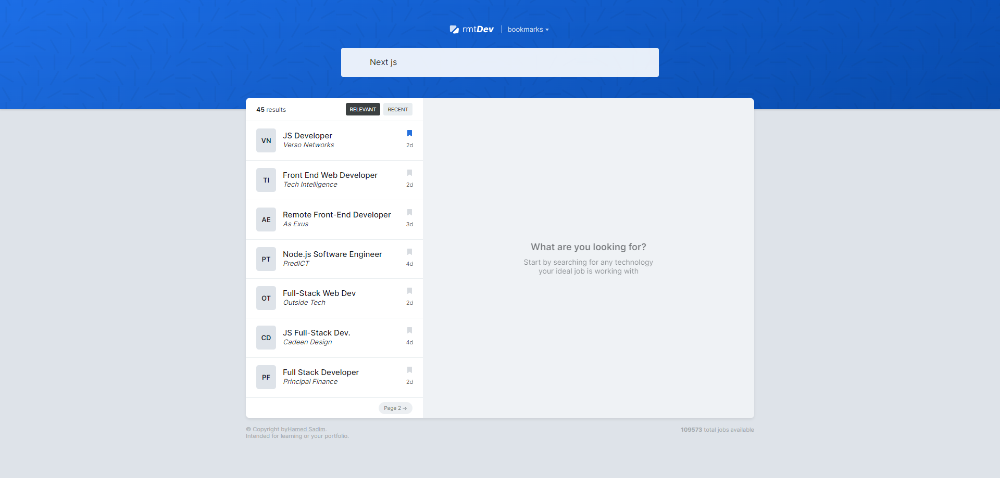

# Job Developer



Een moderne, responsive webapplicatie voor het zoeken naar ontwikkelaarsbanen. Gebouwd met React, TypeScript en Vite voor een snelle en efficiënte gebruikerservaring.

## Beschrijving

Job Developer is een gebruiksvriendelijke applicatie waarmee gebruikers kunnen zoeken naar banen in de tech-industrie. De app biedt geavanceerde zoekfunctionaliteiten, bladwijzers voor favoriete vacatures, en een intuïtieve interface voor het beheren van job listings.

## Features

- **Zoekfunctionaliteit**: Zoek banen op basis van trefwoorden, locatie en andere criteria.
- **Bladwijzers**: Sla favoriete vacatures op voor later bekijken.
- **Paginatie**: Efficiënt navigeren door grote lijsten met vacatures.
- **Sorteeropties**: Sorteer resultaten op relevantie, datum of andere parameters.
- **Responsive Design**: Werkt perfect op desktop, tablet en mobiele apparaten.
- **Real-time Updates**: Gebruik van TanStack Query voor optimale data fetching en caching.

## Tech Stack

- **Frontend**: React 19, TypeScript
- **Build Tool**: Vite
- **State Management**: React Context API
- **Data Fetching**: TanStack React Query
- **UI Components**: Radix UI Icons
- **Notifications**: React Hot Toast
- **Linting**: ESLint met TypeScript ondersteuning

## Installatie

1. **Clone de repository**:

   ```bash
   git clone https://github.com/your-username/job-developer.git
   cd job-developer
   ```

2. **Installeer dependencies**:

   ```bash
   npm install
   ```

3. **Start de development server**:

   ```bash
   npm run dev
   ```

4. **Open je browser** en ga naar `http://localhost:5173`.

## Gebruik

- Gebruik het zoekformulier om banen te vinden.
- Klik op het bladwijzer-icoon om vacatures op te slaan.
- Gebruik de sorteer- en pagineringscontroles om door resultaten te navigeren.
- Bekijk gedetailleerde informatie over elke vacature in de job item content sectie.

## Scripts

- `npm run dev`: Start de development server met hot reloading.
- `npm run build`: Bouw de applicatie voor productie.
- `npm run lint`: Controleer de code op ESLint fouten.
- `npm run preview`: Bekijk de geproduceerde build lokaal.

## Bijdragen

Bijdragen zijn welkom! Volg deze stappen:

1. Fork de repository.
2. Maak een feature branch: `git checkout -b feature/nieuwe-feature`.
3. Commit je wijzigingen: `git commit -m 'Voeg nieuwe feature toe'`.
4. Push naar de branch: `git push origin feature/nieuwe-feature`.
5. Open een Pull Request.

## Licentie

Dit project is gelicentieerd onder de MIT License. Zie het [LICENSE](LICENSE) bestand voor meer details.

## Contact

Voor vragen of ondersteuning, neem contact op via [hamid.sadim@outlook.com](mailto:hamid.sadim@outlook.com).
